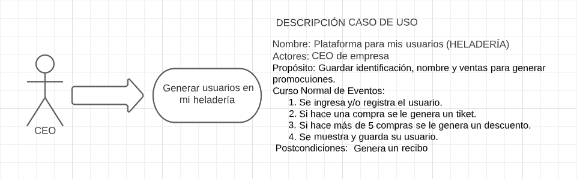

# Heladería

Este es un programa simple de prueba para una heladería que permite al usuario seleccionar y comprar helados. El programa incluye autenticación de usuario, selección de helados, cálculo de precios y aplicación de descuentos.

## Requisitos

- Java JDK instalado
- IDE de Java (como Eclipse, IntelliJ, NetBeans) o un editor de texto para ejecutar el programa

## Instrucciones

1. Descarga o clona el repositorio del programa.
2. Abre el archivo `Heladeria.java` en tu IDE de Java o editor de texto.
3. Compila y ejecuta el programa.

## Funcionalidades

El programa ofrece las siguientes funcionalidades:

- Autenticación de usuario y contraseña antes de acceder al menú de helados.
- Menú de helados con opciones para seleccionar el tipo de helado y la cantidad deseada.
- Cálculo del precio total basado en el precio unitario y la cantidad de helados.
- Aplicación de descuento del 10% si se compran 4 o más helados.
- Mostrar el detalle de la compra, incluyendo el tipo de helado, la cantidad, el precio unitario, el descuento (si corresponde) y el total a pagar.

## Contribuciones

Si deseas contribuir a este proyecto, siéntete libre de hacerlo. Puedes abrir problemas (issues) o enviar solicitudes de extracción (pull requests) con tus mejoras o correcciones.

##PSEUDOCODIGO

Algoritmo Heladeria
    Definir usr, contra como cadena
    Definir usrcorrecto, contracorrecta como cadena
    Definir preciohelado, descuento como real
    Definir opc, cantidad como entero
    Definir total como real

    Mostrar "----Bienvenidos a Mochhia----"
    Mostrar "-----------------------------"

    Definir autenticado como booleano
    autenticado = Falso
    Mientras no autenticado hacer
        Mostrar "Digite su nombre de usuario: "
        Leer usr
        Mostrar "Digite su contraseña: "
        Leer contra
        
        Si usr = usrcorrecto y contra = contracorrecta entonces
            autenticado = Verdadero
        Sino
            Mostrar "Usuario y/o contraseña incorrectas"
        Fin Si
    Fin Mientras

    Mostrar ""
    Mostrar "Menú de helados"
    Mostrar "-----------------"
    Mostrar "1. Helado de fresa"
    Mostrar "2. Helado de chocolate"
    Mostrar "3. Helado de nutella"
    Mostrar "-------------------"
    Mostrar "Selecciona tu helado a pedir"
    Leer opc
    Mostrar "Ingresa la cantidad a comprar"
    Leer cantidad
    total = preciohelado * cantidad

    Mostrar "-----------------------------------"
    Mostrar "---Gracias por comprar en Mochaa---"
    Mostrar "Helado seleccionado: " + opc
    Mostrar "Cantidad de helados: " + cantidad
    Mostrar "Precio unitario: " + preciohelado
    Si cantidad > 4 entonces
        total = total - total * descuento
        Mostrar "Descuento por compra mayor igual a 4: " + descuento * 100 + "%"
    Sino
        Mostrar "No aplica descuento"
    Fin Si

    Mostrar "Total a pagar: " + total
Fin Algoritmo

## Caso de usuario

## Digrama de flujo

## JIRA

