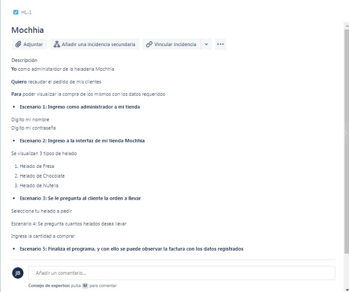

# Heladería

Este es un programa simple de prueba para una heladería que permite al usuario seleccionar y comprar helados. El programa incluye autenticación de usuario, selección de helados, cálculo de precios y aplicación de descuentos.

## Requisitos

- Java JDK instalado
- IDE de Java (como Eclipse, IntelliJ, NetBeans) o un editor de texto para ejecutar el programa

## Instrucciones

1. Descarga o clona el repositorio del programa.
2. Abre el archivo `Heladeria.java` en tu IDE de Java o editor de texto.
3. Compila y ejecuta el programa.

## Funcionalidades

El programa ofrece las siguientes funcionalidades:

- Autenticación de usuario y contraseña antes de acceder al menú de helados.
- Menú de helados con opciones para seleccionar el tipo de helado y la cantidad deseada.
- Cálculo del precio total basado en el precio unitario y la cantidad de helados.
- Aplicación de descuento del 10% si se compran 4 o más helados.
- Mostrar el detalle de la compra, incluyendo el tipo de helado, la cantidad, el precio unitario, el descuento (si corresponde) y el total a pagar.

## Contribuciones

Si deseas contribuir a este proyecto, siéntete libre de hacerlo. Puedes abrir problemas (issues) o enviar solicitudes de extracción (pull requests) con tus mejoras o correcciones.
#Caso de usuario

#Digrama de flujo

#JIRA

# ProyectoED
